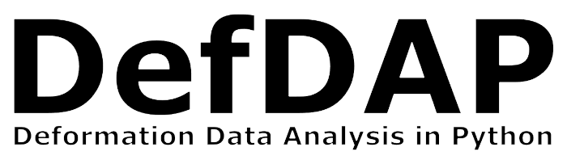

==============
A set of scripts for dealing with EBSD and HRDIC data.

  <a href="#how-to-install">How to install</a> •
  <a href="#how-to-use">How To Use</a> •
  <a href="#documentation">Documentation</a> •
  <a href="#credits">Credits</a> •
  <a href="#license">License</a>

## How to install

- Download and install Anaconda from https://repo.continuum.io/archive/ (version 4.4 has been tested)

- Download the DefDAP package using the 'Clone or download' button above, and extract to a directory

- Open a terminal in that directory and run `pip install .` (or `pip install -e .` if you want to work on the scripts)

## How to use

- To start the example notebook, use the command `jupyter notebook` and click the notebook (.ipynb file)

## Documentation

- For more help, see the documentation under /docs/html

## Credits

The software uses the following open source packages:

- [scipy](http://scipy.org/)
- [numpy](http://numpy.org/)
- [matplotlib](http://matplotlib.org/)
- [scikit-image](http://scikit-image.org/)
- [pandas](http://pandas.pydata.org)
- [peakutils](https://peakutils.readthedocs.io/en/latest/)
- [matplotlib_scalebar](https://pypi.org/project/matplotlib-scalebar/)
- [vtk](https://vtk.org/)
- [pyevtk](https://pypi.org/project/pyevtk/)
- [IPython](https://ipython.org/)
- [jupyter](https://jupyter.org/)

## License

MIT license