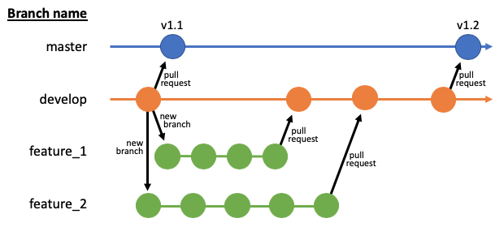

Contributing
===========================

We welcome any improvements made to this package, but please follow the guidelines below when making changes.

Coding style
-----------------

In this project we (try) to follow the PEP8 standard for formatting python code with 2 notable exceptions:
- Function and variable names are in mixed case e.g myFirstFunction
- The 79 character line length limit is seen more as a guideline than rule. Code is split across lines where possible and to improve readability. Line length should never excede 119 characters. All documentation should be split to lines of less than 73 characters.

Repository Structure
---------------------

The schematic below shows the intended structure of the branches in this repository, based on `Gitflow <https://www.atlassian.com/git/tutorials/comparing-workflows/gitflow-workflow>`_. The `master` branch will be committed to at regular intervals by an administrator and each release will be given a tag with a version number. This is the first branch that is visible and we (will eventually) have controls in place to ensure this branch always works correctly. The `develop` branch contains new features which may not be significant enough to form part of the 'master' branch just yet. The final type of branch is the feature branch (green), such as `feture_1` and `feature_2`. This is where you come in! If you would like to make a new feature or fix a bug, simply make a branch from develop with a reasonable name and make a start on any changes you would like to make. Don't be afraid of breaking anything at this point, there are controls in place to help make sure buggy code does not make it into `develop` or `master`.

   Repository structure

Instructions
-----------------

1. Making an 'issue' first is recommended when adding a new feature or fixing a bug, especially if you're not sure how to go about the change. Advice can then be given on the best way forward.
2. Using your local git client (GitHub Desktop is easy to use), checkout the `develop` branch by selecting it (making sure you 'Pull Origin' after).
3. Create a new branch with an appropriate name, using underscores where appropriate, for example `new_feature`
4. Make any changes necessary in your favourite editor (PyCharm is recommended).
5. Test to make sure the feature works correctly in your Jupyter Notebook.
6. Commit the change to your new branch using the 'Commit to new_feature' button and include a descriptive title and description for the commit, making sure you click 'Push origin' when this is done.
7. Make additional commits if necessary.
8. Raise a pull request.

Additional notes
-----------------

- Always make a branch from `develop`, don't try to make a branch from `master` or any feature branch.
- You will not be able to complete a pull request into `develop` without a review by Mike or Rhys.
- Try to avoid adding any dependencies to the code, if you do need to, add a comment to your 'issue' with the details.

Documentation
-----------------

Where possible, update or add documentation at the beginning of the function you are making or changing, adding references if required. This is important so that other people know how to use your code and so that we can validate any methods you use. We are following the `NumPy Docs Style Guide <https://docs.scipy.org/doc/numpy-1.15.0/docs/howto_document.html>`_, but you can use any of the documentation in the code as an example. Add comments where it is not clear what you have done.
