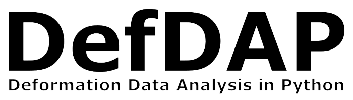

DefDAP Documentation
===================================================

.. |pypi| image:: https://img.shields.io/pypi/v/defdap
   :target: https://pypi.org/project/defdap
   :alt: PyPI version

.. |python| image:: https://img.shields.io/pypi/pyversions/defdap
   :target: https://pypi.org/project/defdap
   :alt: Supported python versions

.. |docs| image:: https://readthedocs.org/projects/defdap/badge/?version=latest
   :target: https://defdap.readthedocs.io/en/latest/?badge=latest
   :alt: Documentation status

.. |doi| image:: https://zenodo.org/badge/DOI/10.5281/zenodo.3688096.svg
   :target: https://doi.org/10.5281/zenodo.368809
   :alt: DOI

DefDAP is a python library for correlating EBSD and HRDIC data, developed by Michael Atkinson and Rhys Thomas.

|pypi| |python| |docs| |doi|

.. grid:: 4
   :gutter: 3

   .. grid-item-card:: User guide
      :link: userguide
      :link-type: doc
      :text-align: center
      :shadow: lg

      :octicon:`gear;5em`

   .. grid-item-card:: Contributing
      :link: contributing
      :link-type: doc
      :text-align: center
      :shadow: lg

      :octicon:`workflow;5em`

   .. grid-item-card:: Papers
      :link: papers
      :link-type: doc
      :text-align: center
      :shadow: lg

      :octicon:`book;5em`

   .. grid-item-card:: API Reference
      :link: modules
      :link-type: doc
      :text-align: center
      :shadow: lg

      :octicon:`file-code;5em`

If this software is used in the preparation of published work please cite:

`Atkinson, Michael D, Thomas, Rhys, Harte, Allan, Crowther, Peter, & Quinta da Fonseca, João. (2020, May 4). DefDAP: Deformation Data Analysis in Python - v0.92 (Version 0.92). Zenodo.  <http://doi.org/10.5281/zenodo.3784775>`_

This software is distributed under Apache License 2.0.

.. toctree::
   :hidden:
   :maxdepth: 1
   
   userguide
   contributing
   papers
   modules